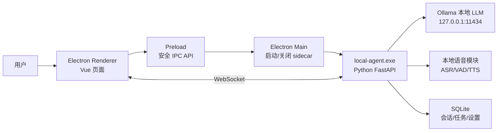
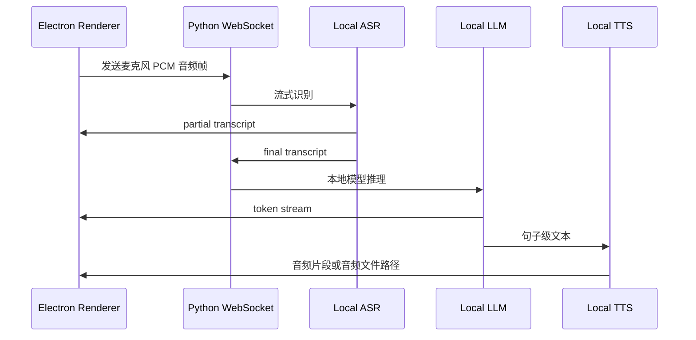

# MVP 技术栈与技术架构方案

本文档用于指导第一版可运行 MVP 的开发。目标不是一次性做完整“下一代实时自然语音任务 Agent”，而是先跑通最小闭环：PC 桌面端启动后，可以连接本地大模型，完成本地对话、基础语音输入/播报、任务拆解、任务看板更新，并具备后续扩展工具调用和打包发布的结构。

硬约束：MVP 不调用云端大模型。LLM、Embedding、ASR、TTS 均优先使用本机服务或本地模型。任何网络 API 只能作为业务工具连接器，不作为大模型推理来源。

## 1. MVP 目标

MVP 只验证 5 件事：

1. Electron PC 桌面端能启动，并管理本地 Python 后端。
2. Python 后端能连接本地大模型服务，完成流式文本对话。
3. 用户能通过麦克风输入语音，转成本地文字，再交给本地大模型处理。
4. 大模型能把用户目标拆成任务，并同步到任务看板。
5. 应用能被打包成 Windows 桌面应用，Python 后端作为 sidecar 一起进入安装包。

## 2. MVP 不做什么

为了尽快跑通，MVP 暂不做以下能力：

| 暂不做 | 原因 |
| --- | --- |
| 复杂 Gmail/Slack/GitHub 深度连接器 | OAuth、权限、安全审计会拉长周期。 |
| 自动支付、下单、发送外部消息 | 高风险动作需要完整权限体系，放到后续阶段。 |
| 完整自然打断和情绪识别 | MVP 先做“持续监听 + 停止播报”基础版。 |
| 多 Agent 协作 | 先用单 Agent 编排器，避免复杂度过早上升。 |
| 内置所有大模型文件 | 模型文件体积大，MVP 先检测本机 Ollama 或用户导入模型。 |
| 跨平台完整支持 | MVP 优先 Windows，后续再补 macOS/Linux。 |

## 3. MVP 推荐技术栈

| 层级 | MVP 技术 | 选择理由 |
| --- | --- | --- |
| 桌面端 | Electron + electron-vite | 当前项目已使用，适合 PC 打包和本地进程管理。 |
| 前端 | Vue 3 + TypeScript + Pinia + Vue Router | 复用现有工程，适合聊天页、任务页、设置页。 |
| UI | Element Plus + Tailwind CSS / Less | 当前项目已有依赖，MVP 不再引入新 UI 框架。 |
| 后端 | Python 3.11+ + FastAPI + WebSocket | WebSocket 适合流式对话、语音状态、任务事件推送。 |
| 本地 LLM | Ollama | 开发最快，提供本地 API，方便接入 Qwen、Llama、DeepSeek Distill 等本地模型。 |
| 本地模型备选 | llama.cpp server | 后续需要完全内置模型时使用，MVP 保留接口。 |
| ASR | sherpa-onnx Streaming ASR | 本地流式语音识别，适合后续演进到实时自然语音。 |
| VAD | sherpa-onnx / Silero VAD | 判断用户是否在说话、是否句尾停顿。 |
| TTS | Piper 或 sherpa-onnx TTS | 本地语音合成，先保证可播报和可取消。 |
| 数据库 | SQLite | 本地轻量存储会话、任务、设置、审计日志。 |
| 向量库 | MVP 暂不接，后续 LanceDB | MVP 先不做复杂知识库 RAG，减少依赖。 |
| 打包 | electron-builder + PyInstaller onedir | Electron 打包桌面端，Python 后端打包为本地可执行目录。 |

## 4. MVP 总体架构



核心原则：

- Electron 负责桌面应用、窗口、托盘、权限提示、进程管理。
- Python 后端负责 Agent 逻辑、本地模型调用、语音处理和数据存储。
- 前端不直接访问模型、文件系统或 Shell。
- Python 后端只监听 `127.0.0.1`，不开放局域网访问。
- 所有模型请求默认只允许发往本机地址。

## 5. MVP 运行时进程

```text
electron-app.exe
  ├─ Electron Main
  ├─ Electron Renderer
  └─ local-agent.exe
       ├─ FastAPI HTTP API
       ├─ WebSocket event stream
       ├─ Local LLM client
       ├─ Speech pipeline
       └─ SQLite storage
```

启动流程：

1. 用户打开桌面应用。
2. Electron Main 检查 `local-agent.exe` 是否存在。
3. Electron Main 启动 `local-agent.exe --host 127.0.0.1 --port 8765`。
4. Renderer 通过 IPC 获取后端端口和一次性 token。
5. Renderer 建立 `ws://127.0.0.1:8765/ws/events` 连接。
6. 后端检查 Ollama 是否可用。
7. 如果本地模型未就绪，前端跳转到设置页提示用户配置模型。

## 6. MVP 模块拆分

### 6.1 Electron Main

职责：

- 启动和关闭 Python sidecar。
- 检查后端健康状态。
- 为 Renderer 提供安全 IPC。
- 管理麦克风权限、系统通知和应用退出。
- 打包后定位 `process.resourcesPath` 下的后端文件。

MVP 需要实现：

```text
localAgentService.ts
  - startAgent()
  - stopAgent()
  - restartAgent()
  - getAgentStatus()
  - waitForHealth()
```

### 6.2 Electron Renderer

保留当前页面基础，MVP 需要重点完成：

| 页面 | MVP 功能 |
| --- | --- |
| ChatView | 文本对话、流式输出、语音输入状态。 |
| TasksView | 展示任务列表、任务状态、任务进度。 |
| SettingsView | 配置 Ollama 地址、模型名、语音开关。 |
| KnowledgeView | MVP 只保留入口，暂不做完整知识库。 |

### 6.3 Python Local Agent Runtime

职责：

- 提供健康检查 API。
- 提供 WebSocket 事件通道。
- 调用本地 LLM。
- 执行基础 Agent 编排。
- 写入 SQLite。
- 执行 ASR/TTS。

MVP 后端目录建议：

```text
local-agent/
  app/
    main.py
    config.py
    api/
      health.py
      chat.py
      tasks.py
    ws/
      events.py
      voice.py
    agent/
      orchestrator.py
      planner.py
      task_parser.py
    models/
      ollama_client.py
      schemas.py
    speech/
      asr.py
      vad.py
      tts.py
    storage/
      db.py
      migrations.py
      repositories.py
    security/
      local_only.py
      audit.py
  pyproject.toml
  agent.spec
```

## 7. MVP Agent 能力

MVP Agent 不需要复杂多轮工具调用，先实现 3 种意图：

| 意图 | 示例 | 行为 |
| --- | --- | --- |
| 普通对话 | “这个软件现在能做什么？” | 本地 LLM 直接回答。 |
| 任务拆解 | “帮我整理一个开发计划” | LLM 输出结构化任务列表，写入 SQLite。 |
| 任务更新 | “把第一个任务标记完成” | 后端匹配任务并更新状态。 |

任务拆解输出统一为 JSON：

```json
{
  "type": "task_plan",
  "summary": "完成本地语音智能体 MVP",
  "tasks": [
    {
      "title": "搭建 Python 本地后端",
      "description": "提供健康检查、聊天和任务接口",
      "priority": "high",
      "status": "todo"
    }
  ]
}
```

后端必须校验 JSON，不允许模型直接写数据库。流程是：

```text
用户输入 -> LLM 生成 JSON -> Pydantic 校验 -> SQLite 写入 -> WebSocket 推送 UI
```

## 8. MVP 语音链路

MVP 语音先做“基础实时”，不追求完整真人通话体验：



MVP 可接受的简化：

- 用户点击麦克风按钮后进入持续监听。
- 先实现一句话结束后的处理，不强求边说边规划。
- 播报时如果再次检测到用户说话，先停止播报。
- ASR 准确率不足时，允许用户在文本框中编辑识别结果再发送。

## 9. MVP API 设计

### 9.1 HTTP API

```text
GET  /health
GET  /models/status
POST /chat
GET  /tasks
POST /tasks
PATCH /tasks/{task_id}
GET  /settings
PUT  /settings
```

### 9.2 WebSocket

```text
ws://127.0.0.1:8765/ws/events
ws://127.0.0.1:8765/ws/voice
```

事件格式：

```json
{
  "event": "assistant.delta",
  "request_id": "uuid",
  "payload": {
    "text": "正在为你拆解任务"
  }
}
```

MVP 事件类型：

| 事件 | 用途 |
| --- | --- |
| `assistant.delta` | LLM 流式文本。 |
| `assistant.done` | 一轮回复结束。 |
| `voice.partial` | ASR 增量识别结果。 |
| `voice.final` | ASR 最终识别结果。 |
| `task.created` | 任务创建。 |
| `task.updated` | 任务状态更新。 |
| `system.error` | 错误提示。 |
| `model.status` | 本地模型可用状态。 |

## 10. MVP 数据库设计

SQLite 即可，建议首版只建 5 张表：

```sql
conversations(id, title, created_at, updated_at)
messages(id, conversation_id, role, content, created_at)
tasks(id, title, description, status, priority, progress, created_at, updated_at)
settings(key, value, updated_at)
audit_logs(id, action, detail_json, created_at)
```

数据存储位置：

- 开发环境：项目根目录下的 `data/app.db`。
- 打包后：Electron 的 `app.getPath('userData')` 对应目录。
- 不把用户数据写入安装目录。

## 11. MVP 打包架构

Python 后端可以一起被打包，但建议使用 PyInstaller `onedir`，而不是 `onefile`。

原因：

- `onedir` 启动更快。
- 语音模型、动态库、Playwright 或 ONNX 依赖更容易处理。
- Electron `extraResources` 可以直接把整个目录放进安装包。

打包后结构：

```text
安装目录/
  electron-app.exe
  resources/
    local-agent/
      local-agent.exe
      _internal/
      models/
        asr/
        tts/
      config/
```

`electron-builder.yml` 需要加入：

```yaml
extraResources:
  - from: resources/local-agent
    to: local-agent
```

Electron Main 侧路径规则：

```text
开发环境：electron-app/resources/local-agent/local-agent.exe
生产环境：process.resourcesPath/local-agent/local-agent.exe
```

MVP 模型打包策略：

| 模型类型 | MVP 策略 |
| --- | --- |
| LLM 大模型 | 不内置，检测本机 Ollama，用户自行 pull 或导入。 |
| ASR 模型 | 可以内置一个小型中文/中英模型，保证语音输入可演示。 |
| TTS 模型 | 可以内置一个轻量中文音色，保证可播报。 |
| Embedding 模型 | MVP 暂不内置，后续知识库阶段再加。 |

## 12. MVP 开发顺序

建议按以下顺序做，避免先陷入语音模型和打包细节：

1. 本地 LLM 文本对话  
   Electron 调 Python 后端，Python 后端调 Ollama，前端显示流式回复。

2. 任务拆解和任务看板  
   让模型输出结构化 JSON，后端校验后写入 SQLite，前端看板实时刷新。

3. Python sidecar 生命周期  
   Electron 启动、健康检查、重启、退出时关闭后端。

4. 基础语音输入  
   前端采集麦克风，后端 ASR，识别结果回填输入框或自动发送。

5. 基础 TTS 播报  
   后端生成语音，前端播放，支持停止播放。

6. Windows 打包  
   PyInstaller 打包后端，electron-builder 打包桌面端，验证新目录可启动。

## 13. MVP 验收标准

MVP 完成后，应能演示下面的完整流程：

1. 在没有任何云端大模型 API key 的情况下启动桌面应用。
2. 设置页检测到本机 Ollama 和本地模型。
3. 用户输入：“帮我把这个软件的 MVP 开发任务拆一下。”
4. 本地模型流式返回计划。
5. 后端把计划解析为任务列表。
6. 任务页出现待办、执行中、已完成三个状态。
7. 用户点击麦克风，说：“把第一个任务标记为高优先级。”
8. 本地 ASR 识别文字，Agent 更新任务。
9. 本地 TTS 播报：“已更新。”
10. 应用打包后在 Windows 上可安装、启动、退出，并能自动关闭 Python 后端。

## 14. 本地大模型边界

MVP 必须在代码里做硬校验：

```text
允许：
  http://127.0.0.1:11434
  http://localhost:11434
  http://127.0.0.1:<用户配置端口>

禁止：
  https://api.openai.com
  https://api.anthropic.com
  https://generativelanguage.googleapis.com
  其他云端 LLM API
```

建议配置：

```env
ALLOW_REMOTE_LLM=false
LLM_PROVIDER=ollama
LLM_BASE_URL=http://127.0.0.1:11434/v1
LLM_MODEL=qwen2.5:0.5b
AGENT_HOST=127.0.0.1
AGENT_PORT=8765
```

## 15. 主要风险

| 风险 | MVP 处理方式 |
| --- | --- |
| 用户电脑没有本地模型 | 设置页明确提示安装 Ollama 或导入模型。 |
| 本地模型响应慢 | 首版推荐 7B/8B 量化模型，限制上下文长度。 |
| ASR 模型打包复杂 | 先固定一个小模型，模型路径写进配置。 |
| PyInstaller 依赖遗漏 | 使用 `onedir`，把模型和动态库放到 `extraResources`。 |
| 端口被占用 | Electron Main 随机选择可用端口，并传给 Renderer。 |
| 安全边界不清 | Renderer 只走 IPC/WebSocket，不直接执行系统命令。 |

## 16. 参考资料

- [Electron Builder application contents](https://www.electron.build/contents/)
- [PyInstaller usage](https://pyinstaller.org/en/stable/usage.html)
- [FastAPI WebSockets](https://fastapi.tiangolo.com/advanced/websockets/)
- [Ollama OpenAI compatibility](https://docs.ollama.com/api/openai-compatibility)
- [sherpa-onnx](https://k2-fsa.github.io/sherpa/onnx/)
- [Piper TTS](https://github.com/rhasspy/piper)
