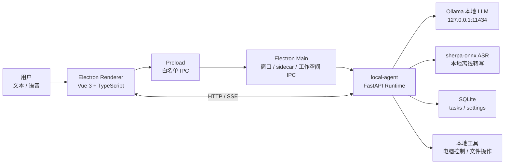

# 实时自然语音 + 任务 AI 智能体

这是一个面向 PC 桌面端的本地 AI Agent MVP 项目。目标是让用户通过文本或语音与桌面应用对话，由本机大模型完成回复、任务拆解、任务看板同步，并逐步扩展到本地电脑控制、工作空间文件操作、知识库和更多工具调用。

项目当前采用双进程架构：

- `electron-app`：Electron + Vue 3 桌面端，负责窗口、页面交互、麦克风采集、会话历史、任务看板、设置页、工作空间选择，以及启动 Python 后端 sidecar。
- `local-agent`：Python + FastAPI 本地后端，负责本地模型调用、Agent 工作流、任务持久化、离线 ASR、设置存储、安全校验和本地工具执行。

核心约束：MVP 默认不调用云端大模型。LLM 推理只允许访问 `127.0.0.1`、`localhost` 或 `::1` 上的本地模型服务。

## 当前能力

| 能力 | 当前状态 | 说明 |
| --- | --- | --- |
| 桌面端启动 | 已实现 | Electron Main 会检测/启动 `local-agent`，健康检查通过后创建窗口。 |
| 本地模型聊天 | 已实现 | 后端接入 Ollama，支持原生 `/api/chat` 和 OpenAI-compatible `/v1/chat/completions`。 |
| 流式回复 | 已实现 | `/chat` 支持 SSE，前端逐 token 更新聊天气泡。 |
| 任务拆解 | 已实现 | LangGraph 工作流识别任务规划意图，要求模型输出 JSON，经 Pydantic 校验后写入 SQLite。 |
| 任务看板 | 已实现 | 前端三列看板展示 `todo / in_progress / done`，可更新状态和进度。 |
| 连续语音输入 | 已实现基础版 | 前端使用 Web Audio API 做音频分段和简单 VAD，发送 WAV 到后端离线 ASR 接口。 |
| 本地 ASR | 已实现接口 | 后端使用 `sherpa-onnx` 离线识别，模型缺失时返回 `not_configured`。 |
| TTS 播报 | 已实现前端版 | 当前使用浏览器 `SpeechSynthesis` 播报，后端本地 TTS 仍是后续扩展点。 |
| 本地电脑控制 | 初步实现 | 支持打开网页/应用、搜索、输入、快捷键、点击、滚动等低层动作；敏感动作要求确认。 |
| 工作空间文件操作 | 初步实现 | 支持写入、追加、替换、删除、建目录；路径被限制在用户选择的工作空间内。 |
| 设置持久化 | 已实现 | 模型地址、模型名、thinking 开关、默认输出长度、工作空间路径写入 SQLite。 |
| 知识库页面 | UI 原型 | 当前是静态技能/文档展示，RAG、索引、向量库尚未接入。 |
| Windows 打包 | 已实现脚本 | `npm run build:win` 会先 PyInstaller 打包 Python 后端，再由 electron-builder 打包桌面端。 |

## 总体架构



运行时进程关系：

```text
electron-app
  ├─ Electron Main
  │   ├─ 启动或复用 local-agent
  │   ├─ 监听后端健康状态
  │   ├─ 暴露工作空间选择/打开 IPC
  │   └─ 应用退出时清理自有后端进程
  ├─ Electron Renderer
  │   ├─ ChatView / TasksView / SettingsView / KnowledgeView
  │   ├─ Web Audio 麦克风采集
  │   ├─ SSE 流式对话
  │   └─ Pinia 本地会话缓存
  └─ local-agent
      ├─ FastAPI HTTP API
      ├─ OllamaClient
      ├─ LangGraph Agent Workflow
      ├─ SQLite storage
      └─ sherpa-onnx ASR
```

## 目录结构

```text
.
├─ 需求文档.md
├─ MVP技术栈与技术架构方案.md
├─ 本地大模型PC桌面端技术栈架构方案.md
├─ electron-app/
│  ├─ src/main/                 # Electron Main，sidecar 生命周期和系统 IPC
│  ├─ src/preload/              # Renderer 可访问的安全桥
│  ├─ src/renderer/src/
│  │  ├─ api/                   # local-agent HTTP/SSE 客户端
│  │  ├─ components/            # 通用 UI 组件
│  │  ├─ layout/                # 主布局、侧边栏、顶栏、底栏
│  │  ├─ router/                # Vue Router 路由和守卫
│  │  ├─ store/                 # Pinia 会话和用户状态
│  │  └─ views/                 # 聊天、任务、知识库、设置、登录页
│  ├─ electron-builder.yml      # 安装包配置，包含 local-agent extraResources
│  └─ package.json
└─ local-agent/
   ├─ app/
   │  ├─ api/                   # FastAPI 路由
   │  ├─ agent/                 # Agent 意图识别、任务规划、工具执行
   │  ├─ models/                # Pydantic Schema 和 Ollama 客户端
   │  ├─ security/              # 本地模型地址限制、工作空间路径限制
   │  ├─ speech/                # ASR 实现
   │  ├─ storage/               # SQLite 初始化、任务和设置仓储
   │  ├─ config.py              # 环境变量配置
   │  ├─ main.py                # FastAPI 应用入口
   │  └─ runtime_settings.py    # .env + SQLite 覆盖后的运行时设置
   ├─ runtime_entry.py          # PyInstaller 后端 EXE 入口
   ├─ build_windows.ps1         # Windows 后端打包脚本
   └─ requirements.txt
```

## Electron 桌面端模块

### Main 进程

文件：`electron-app/src/main/index.ts`

职责：

- 创建主窗口。
- 检查 `http://127.0.0.1:8765/health`。
- 在后端不存在时自动启动本地 Python 或已打包的 `local-agent-runtime.exe`。
- 根据开发态/生产态查找后端路径：
  - 开发态源码目录：`../local-agent`
  - 开发态打包产物：`../local-agent/dist/local-agent-runtime/local-agent-runtime.exe`
  - 生产态资源目录：`process.resourcesPath/local-agent`
- 退出应用前关闭由当前应用启动的后端进程。
- 暴露 `workspace:select` 和 `workspace:open` IPC，用于选择/打开工作空间目录。

关键环境变量：

| 变量 | 默认值 | 用途 |
| --- | --- | --- |
| `LOCAL_AGENT_AUTOSTART` | `true` | 是否由 Electron 自动启动后端。 |
| `LOCAL_AGENT_HOST` | `127.0.0.1` | 后端监听地址。 |
| `LOCAL_AGENT_PORT` | `8765` | 后端监听端口。 |
| `LOCAL_AGENT_DIR` | 自动查找 | 指定开发态 Python 后端目录。 |
| `LOCAL_AGENT_PYTHON` | 自动查找 `.venv` | 指定 Python 可执行文件。 |
| `LOCAL_AGENT_EXECUTABLE` | 自动查找 | 指定已打包后端 EXE。 |
| `LOCAL_AGENT_DATA_DIR` | Electron `userData/local-agent` | 生产态 SQLite 数据目录。 |

### Preload 安全桥

文件：

- `electron-app/src/preload/index.ts`
- `electron-app/src/preload/index.d.ts`

当前只暴露两个自定义 API：

```ts
window.api.selectWorkspace(): Promise<string | null>
window.api.openWorkspace(workspacePath: string): Promise<void>
```

Renderer 不直接获得 Node.js、文件系统或 Shell 能力，所有系统能力必须经过 Main 进程白名单 IPC。

### Renderer 前端

主要模块：

| 模块 | 文件 | 说明 |
| --- | --- | --- |
| API 客户端 | `src/renderer/src/api/localAgent.ts` | 封装 `/health`、`/models/status`、`/chat`、`/tasks`、`/settings`、`/voice/transcribe`；支持 SSE 解析。 |
| 聊天页 | `views/ChatView.vue` | 消息列表、文本发送、SSE 流式输出、麦克风连续监听、语音队列、浏览器 TTS。 |
| 任务页 | `views/TasksView.vue` | 三列 Kanban，读取 `/tasks`，通过 `PATCH /tasks/{id}` 更新任务状态。 |
| 设置页 | `views/SettingsView.vue` | 管理 Ollama 地址、模型名、thinking 开关、默认输出长度；展示模型状态。 |
| 知识库页 | `views/KnowledgeView.vue` | 当前为静态 UI 原型，预留技能中心和文档管理入口。 |
| 侧边栏 | `layout/SideNav.vue` | 新建/切换会话、选择工作空间、导航任务/知识库/设置。 |
| 会话状态 | `store/useConversationStore.ts` | 使用 Pinia + localStorage 持久化前端会话历史。 |
| 用户状态 | `store/useUserStore.ts` | 简单 token 和用户名缓存，供路由守卫使用。 |

## Python Local Agent 模块

### FastAPI 应用入口

文件：`local-agent/app/main.py`

职责：

- 创建 FastAPI 应用。
- 配置 CORS，仅允许本地开发、文件协议或 Electron 应用来源。
- 挂载健康检查、模型状态、聊天、任务、设置、语音接口。

当前路由：

| 方法 | 路径 | 模块 | 说明 |
| --- | --- | --- | --- |
| `GET` | `/health` | `api/health.py` | 后端健康检查，返回服务名、版本、本地模型策略。 |
| `GET` | `/models/status` | `api/models.py` | 检查 Ollama 是否可用、模型列表、配置模型是否存在。 |
| `POST` | `/chat` | `api/chat.py` | 普通或流式聊天；根据意图进入不同 Agent 工作流。 |
| `GET` | `/tasks` | `api/tasks.py` | 获取任务列表，可按 status 筛选。 |
| `POST` | `/tasks` | `api/tasks.py` | 手动创建任务。 |
| `PATCH` | `/tasks/{task_id}` | `api/tasks.py` | 更新任务标题、描述、状态、优先级或进度。 |
| `GET` | `/settings` | `api/settings.py` | 获取运行时设置。 |
| `PUT` | `/settings` | `api/settings.py` | 更新模型和工作空间设置。 |
| `POST` | `/voice/transcribe` | `api/voice.py` | 接收 WAV 音频并调用本地 ASR。 |

### 配置系统

文件：

- `local-agent/app/config.py`
- `local-agent/app/runtime_settings.py`
- `local-agent/.env.example`

配置来源分两层：

1. `.env` 和环境变量提供基础配置。
2. SQLite `settings` 表保存用户在设置页修改的覆盖项。

常用配置：

```env
ALLOW_REMOTE_LLM=false
LLM_PROVIDER=ollama
LLM_BASE_URL=http://127.0.0.1:11434
LLM_MODEL=qwen2.5:0.5b
AGENT_HOST=127.0.0.1
AGENT_PORT=8765
DATA_DIR=data
REQUEST_TIMEOUT_SECONDS=120
DEFAULT_MAX_TOKENS=2048
ENABLE_THINKING=false
```

ASR 配置：

```env
ASR_PROVIDER=sherpa-onnx
ASR_MODEL_TYPE=sense_voice
ASR_MODEL=models/asr/sherpa-onnx-sense-voice-zh-en-ja-ko-yue-int8-2024-07-17/model.int8.onnx
ASR_TOKENS=models/asr/sherpa-onnx-sense-voice-zh-en-ja-ko-yue-int8-2024-07-17/tokens.txt
ASR_NUM_THREADS=2
ASR_COMPUTE_PROVIDER=cpu
ASR_SAMPLE_RATE=16000
```

### Ollama 模型客户端

文件：`local-agent/app/models/ollama_client.py`

职责：

- 强制校验 LLM URL 是否允许。
- 支持 Ollama 原生 API：
  - `GET /api/tags`
  - `POST /api/chat`
- 支持 OpenAI-compatible API：
  - `GET /v1/models`
  - `POST /v1/chat/completions`
- 支持流式和非流式回复。
- 对 thinking 模型做空回复保护，避免只返回 thinking 内容而没有最终答案。

URL 安全策略由 `security/local_only.py` 提供：

- 禁止常见云端 LLM 域名，例如 `api.openai.com`、`api.anthropic.com`、`generativelanguage.googleapis.com`、`api.deepseek.com` 等。
- 当 `ALLOW_REMOTE_LLM=false` 时，只允许 `127.0.0.1`、`localhost`、`::1`。

### Agent 工作流

文件：

- `local-agent/app/agent/workflow.py`
- `local-agent/app/agent/task_planner.py`
- `local-agent/app/agent/computer_control.py`
- `local-agent/app/agent/file_control.py`

当前意图类型：

| 意图 | 触发方式 | 行为 |
| --- | --- | --- |
| `chat` | 普通问题 | 直接调用本地模型回复。 |
| `task_plan` | 包含“拆任务、任务拆解、计划、待办、todo、步骤、排期”等关键词 | 先生成用户回复，再要求模型输出任务 JSON，校验后写入 SQLite。 |
| `computer_control` | 包含“打开、启动、搜索、点击、输入、快捷键、滚动”等控制类表达 | 生成本地电脑动作计划并执行；敏感动作返回确认要求。 |
| `file_control` | 包含文件/目录/代码路径和新建、修改、替换、删除等动作 | 在工作空间内规划并执行文件操作。 |

任务拆解流程：

```text
用户输入
  -> understand_request
  -> assistant_reply
  -> generate_task_plan
  -> write_tasks
  -> 返回 reply + tasks_created + workflow_events
```

流式聊天事件类型：

| 事件 | 说明 |
| --- | --- |
| `workflow` | 工作流步骤状态，例如正在理解、正在生成、正在写入任务。 |
| `start` | 模型流式输出开始。 |
| `delta` | 增量文本。 |
| `done` | 本轮回复完成。 |
| `tasks` | 已创建任务列表。 |
| `computer_actions` | 本地电脑控制结果。 |
| `file_actions` | 工作空间文件操作结果。 |
| `error` | 流式过程错误。 |

### 本地电脑控制

文件：`local-agent/app/agent/computer_control.py`

支持工具：

| 工具 | 说明 |
| --- | --- |
| `open_url` | 打开指定网页。 |
| `web_search` | 使用 Bing 搜索关键词。 |
| `open_app` | 打开常见本地应用或指定可执行路径。 |
| `type_text` | 向当前焦点窗口输入文本，优先使用剪贴板粘贴。 |
| `press_key` | 按下单个按键。 |
| `hotkey` | 执行快捷键组合。 |
| `click` | 点击当前位置或指定坐标。 |
| `scroll` | 滚动页面。 |
| `wait` | 等待指定秒数。 |

敏感关键词包括删除、卸载、格式化、付款、支付、转账、下单、购买、发送邮件、发送消息、提交等。命中后不会直接执行，而是返回 `confirm_required`。

### 工作空间文件操作

文件：

- `local-agent/app/agent/file_control.py`
- `local-agent/app/security/workspace.py`

支持动作：

| 动作 | 说明 |
| --- | --- |
| `write_file` | 写入完整文件内容，可覆盖。 |
| `append_file` | 向文件追加内容。 |
| `replace_in_file` | 精确替换文件内文本片段。 |
| `delete_path` | 删除文件或目录。 |
| `create_directory` | 创建目录。 |

安全边界：

- 必须先在桌面端选择工作空间。
- 相对路径会解析到工作空间内。
- 即使用户传入绝对路径，也必须位于当前工作空间内部。
- 超出工作空间范围会抛出 `WorkspaceAccessError`。
- 文件上下文读取限制为 80 KB，最多向模型提供 24,000 字符。

### 语音识别

文件：

- `local-agent/app/api/voice.py`
- `local-agent/app/speech/asr.py`

前端语音链路：

```text
麦克风 getUserMedia
  -> AudioContext / ScriptProcessor
  -> 简单 RMS VAD
  -> 停顿后截取语音片段
  -> 重采样到 16kHz mono
  -> 编码为 16-bit PCM WAV
  -> POST /voice/transcribe
```

后端 ASR 链路：

```text
WAV bytes
  -> 校验 content-type
  -> wave 解析
  -> int16 转 float32
  -> sherpa-onnx OfflineRecognizer
  -> 返回 transcript
```

当前 ASR 是“分段离线识别”，不是 WebSocket 级别的 streaming ASR。后续如要做到更自然的实时对话，可在此基础上增加 VAD/ASR WebSocket 和 partial transcript 事件。

### SQLite 存储

文件：

- `local-agent/app/storage/db.py`
- `local-agent/app/storage/tasks.py`
- `local-agent/app/storage/settings.py`

当前自动创建两张表：

```sql
tasks(
  id TEXT PRIMARY KEY,
  title TEXT NOT NULL,
  description TEXT NOT NULL DEFAULT '',
  status TEXT NOT NULL DEFAULT 'todo',
  priority TEXT NOT NULL DEFAULT 'medium',
  progress INTEGER NOT NULL DEFAULT 0,
  created_at TEXT NOT NULL,
  updated_at TEXT NOT NULL
)

settings(
  key TEXT PRIMARY KEY,
  value TEXT NOT NULL,
  updated_at TEXT NOT NULL
)
```

数据目录：

- 后端独立开发：默认 `local-agent/data/app.db`，取决于启动时工作目录。
- Electron 启动后端：默认传入 `DATA_DIR=<Electron userData>/local-agent`。
- 可通过 `DATA_DIR` 或 `LOCAL_AGENT_DATA_DIR` 覆盖。

## 本地开发

### 环境要求

- Windows 优先。
- Node.js 18+。
- Python 3.11+。
- Ollama 已安装并可启动。
- 如需语音识别，准备 `sherpa-onnx` ASR 模型文件。

### 准备 Ollama

```powershell
ollama serve
ollama pull qwen2.5:0.5b
```

如果使用其他本地模型，在 `local-agent/.env` 或设置页中修改 `LLM_MODEL`。

### 启动 Python 后端

```powershell
cd local-agent
python -m venv .venv
.\.venv\Scripts\activate
pip install -r requirements.txt
copy .env.example .env
uvicorn app.main:app --host 127.0.0.1 --port 8765
```

验证：

```powershell
Invoke-RestMethod http://127.0.0.1:8765/health
Invoke-RestMethod http://127.0.0.1:8765/models/status
```

### 启动 Electron 桌面端

```powershell
cd electron-app
npm install
npm run dev
```

开发态下 Electron 会尝试自动启动 `local-agent`。如果你已经手动启动了后端，Electron 会复用现有的健康后端进程。

### 直接测试聊天接口

非流式：

```powershell
$body = @{
  prompt = "你好，用一句话介绍你自己"
  max_tokens = 512
  think = $false
} | ConvertTo-Json

Invoke-RestMethod `
  -Method Post `
  -Uri http://127.0.0.1:8765/chat `
  -ContentType "application/json" `
  -Body $body
```

任务拆解：

```powershell
$body = @{
  prompt = "帮我把这个软件的 MVP 开发任务拆成 todo list"
  max_tokens = 1024
  think = $false
} | ConvertTo-Json

Invoke-RestMethod `
  -Method Post `
  -Uri http://127.0.0.1:8765/chat `
  -ContentType "application/json" `
  -Body $body

Invoke-RestMethod http://127.0.0.1:8765/tasks
```

## ASR 模型准备

当前推荐模型：

```text
sherpa-onnx-sense-voice-zh-en-ja-ko-yue-int8-2024-07-17
```

下载示例：

```powershell
cd local-agent
New-Item -ItemType Directory -Force .\models\asr | Out-Null
Invoke-WebRequest `
  -Uri https://github.com/k2-fsa/sherpa-onnx/releases/download/asr-models/sherpa-onnx-sense-voice-zh-en-ja-ko-yue-int8-2024-07-17.tar.bz2 `
  -OutFile .\models\asr\sense-voice.tar.bz2
tar -xjf .\models\asr\sense-voice.tar.bz2 -C .\models\asr
Remove-Item .\models\asr\sense-voice.tar.bz2
```

如果模型或依赖缺失，`POST /voice/transcribe` 会返回：

```json
{
  "status": "not_configured",
  "transcript": "",
  "message": "...",
  "audio_bytes": 0
}
```

前端会把该信息显示为语音识别错误提示。

## Windows 打包

后端单独打包：

```powershell
cd local-agent
.\build_windows.ps1 -Clean
```

产物：

```text
local-agent/dist/local-agent-runtime/local-agent-runtime.exe
```

完整桌面端打包：

```powershell
cd electron-app
npm run build:win
```

`build:win` 执行顺序：

1. 运行 `../local-agent/build_windows.ps1 -Clean`。
2. 执行 `npm run build`，完成 Electron/Vue 构建。
3. 执行 `electron-builder --win --config`。
4. 通过 `electron-builder.yml` 的 `extraResources` 把后端目录复制到安装包资源中。

相关配置：

```yaml
extraResources:
  - from: ../local-agent/dist/local-agent-runtime
    to: local-agent
    filter:
      - '**/*'
```

## 安全与隐私边界

当前已实现的安全控制：

- 本地模型地址校验：默认只允许 `127.0.0.1`、`localhost`、`::1`。
- 云端 LLM 域名黑名单：禁止常见云端大模型 API host。
- Renderer 系统能力白名单：只通过 Preload 暴露工作空间选择/打开。
- 文件操作工作空间沙箱：所有路径必须落在用户选择的工作空间内。
- 敏感电脑动作确认：支付、下单、删除、发送内容等动作不会自动执行。
- SQLite 设置白名单：只允许保存指定配置键。

仍建议后续补强：

- 工具调用审计日志。
- 用户确认记录表。
- Shell 命令白名单或完全禁用策略。
- 外部连接器权限管理和撤销机制。
- 本地 TTS 输出前的敏感信息脱敏。
- WebSocket 语音流鉴权和请求 token。

## 设计和实现取舍

当前实现与长期目标的差异：

- 方案文档中提到 WebSocket 事件流，但当前聊天采用 HTTP + SSE，语音采用 HTTP 分段转写。
- 当前 TTS 是前端浏览器 `SpeechSynthesis`，不是 Piper 或 sherpa-onnx TTS。
- 当前 ASR 是离线片段识别，不是 streaming ASR partial result。
- 当前知识库页是 UI 原型，尚未接入 SQLite FTS5、LanceDB 或本地 embedding。
- 当前对话历史只存在 Renderer 的 localStorage，后端暂未建立 `conversations/messages` 表。
- 当前电脑控制和文件控制已具备原型能力，但缺少完整审计、用户确认 UI 和权限策略页面。

## 建议后续开发顺序

1. 完善任务闭环：让任务创建、状态变化、Agent 执行进度有统一事件和审计记录。
2. 后端化会话历史：新增 `conversations`、`messages` 表，避免聊天记录只存在前端。
3. 语音链路升级：从 HTTP 分段 ASR 演进到 WebSocket VAD/ASR partial transcript。
4. 本地 TTS 接入：增加 `speech/tts.py` 和 `/voice/synthesize` 或音频流接口。
5. 知识库最小闭环：先做本地 Markdown/TXT 导入、SQLite FTS5 检索，再接 LanceDB。
6. 工具权限系统：为电脑控制、文件操作、外部 API 增加风险等级、确认弹窗和审计日志。
7. 模型管理页：检测 Ollama、列出模型、pull 指引、切换模型、上下文长度和 thinking 设置。

## 常见问题

### 模型状态显示 Ollama 未连接

确认 Ollama 已启动：

```powershell
ollama serve
Invoke-RestMethod http://127.0.0.1:11434/api/tags
```

确认设置页中的模型服务地址是：

```text
http://127.0.0.1:11434
```

### 模型服务已连接，但配置模型不存在

拉取对应模型：

```powershell
ollama pull qwen2.5:0.5b
```

或在设置页把模型名称改成 `GET /models/status` 返回的已安装模型名。

### Electron 没有自动启动后端

可检查：

- `LOCAL_AGENT_AUTOSTART` 是否被设置为 `false`。
- `local-agent/.venv/Scripts/python.exe` 是否存在。
- `LOCAL_AGENT_DIR` 或 `LOCAL_AGENT_EXECUTABLE` 是否指向正确路径。
- 端口 `8765` 是否被其他进程占用。

### 语音识别返回 not_configured

通常是以下原因之一：

- 没有安装 `sherpa-onnx`。
- 没有下载 ASR 模型。
- `.env` 中 `ASR_MODEL` 或 `ASR_TOKENS` 路径错误。
- 后端启动工作目录不是 `local-agent`，导致相对模型路径无法解析。

### 文件操作失败：请先选择工作空间

在桌面端左侧栏点击“选择工作空间”，选择一个本地目录后再发起文件操作类指令。

## 参考文档

- `需求文档.md`：产品需求和体验目标。
- `MVP技术栈与技术架构方案.md`：首版 MVP 技术栈、API、打包、验收标准。
- `本地大模型PC桌面端技术栈架构方案.md`：长期架构、语音链路、工具执行层和知识库方案。
- `local-agent/README.md`：Python 后端接口和调试说明。
- `electron-app/README.md`：Electron 工程启动和打包说明。
