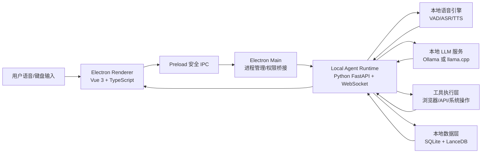
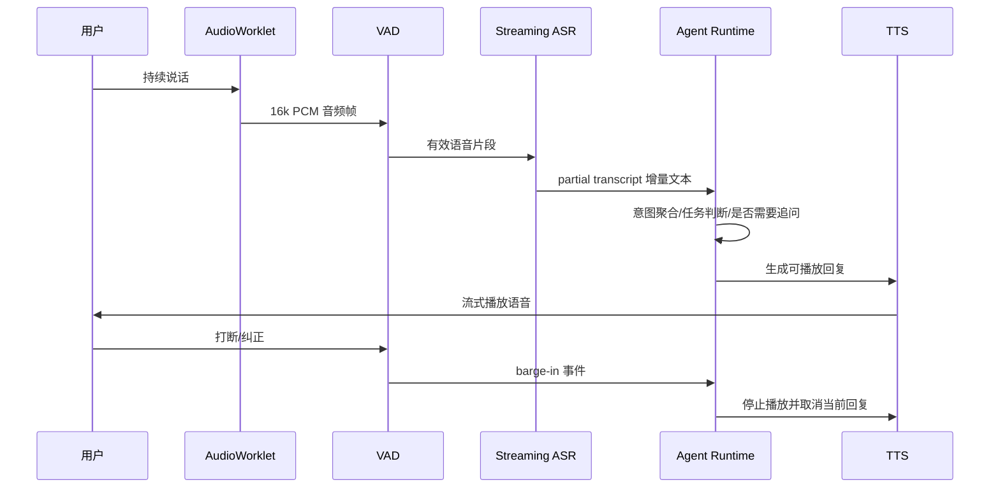
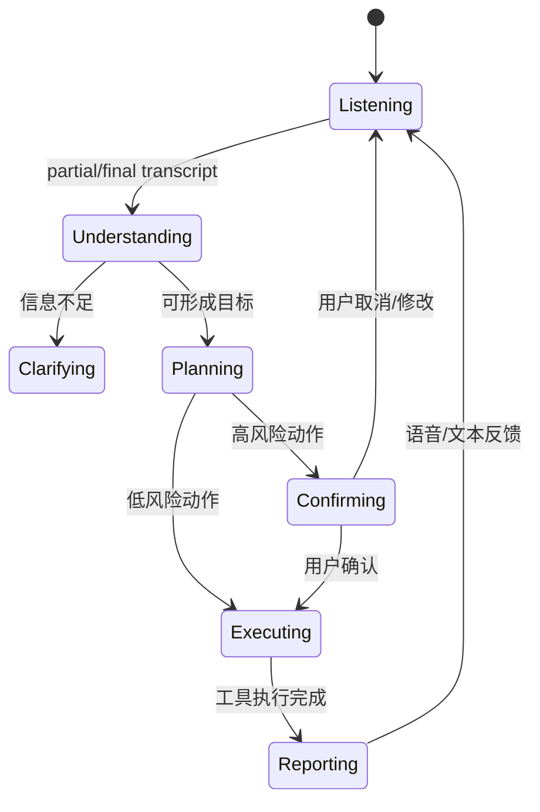

# PC 桌面端本地大模型智能体技术栈架构方案

本文档基于 [需求文档.md](./需求文档.md) 制定，目标是开发一款 PC 桌面端软件，实现“实时自然语音 + 任务 Agent”的闭环体验。

核心约束：所有大模型推理、语音识别、语音合成、Embedding 和知识库检索都在本机运行，不调用 OpenAI、Claude、Gemini、通义千问云服务、智谱云服务等云端大模型接口。

## 1. 总体技术路线

建议沿用当前项目已有的 Electron + Vue + TypeScript 桌面端工程，在本机额外启动一个 Local Agent Runtime 作为智能体后端服务。桌面 UI 负责交互、任务看板、语音状态和确认弹窗；本地后端负责语音流、模型调用、任务规划、工具执行、知识库检索和审计日志。

推荐总架构：



## 2. 推荐技术栈

| 模块 | 推荐技术 | 说明 |
| --- | --- | --- |
| 桌面外壳 | Electron + electron-vite | 项目中已存在 Electron 工程，继续使用可减少迁移成本。 |
| 前端 UI | Vue 3 + TypeScript + Pinia + Vue Router | 已在现有 `electron-app` 中使用，适合聊天页、任务看板、设置页和知识库页。 |
| UI 组件 | Element Plus + Tailwind CSS / Less | 保留现有组合；后续可统一成一套设计系统。 |
| 本地智能体后端 | Python 3.11+ + FastAPI + WebSocket + Pydantic | Python 更适合整合本地模型、语音、浏览器自动化和文件处理；WebSocket 适合实时语音流和增量输出。 |
| 本地 LLM 服务 | Ollama 优先，llama.cpp 作为产品化/嵌入式备选 | Ollama 方便模型管理和本地 OpenAI-compatible API；llama.cpp 适合直接打包 GGUF 模型和精细控制推理参数。 |
| 任务 Agent 编排 | 自研轻量 Orchestrator + JSON Schema 工具协议 | 不依赖云端 Agent SDK，便于权限控制、审计和本地化。复杂后续可引入 LangGraph，但不是 MVP 必需。 |
| 实时 ASR | sherpa-onnx Streaming ASR | 支持本地流式语音识别、增量 partial result，适合“边听边理解”。 |
| VAD/端点检测 | Silero VAD via sherpa-onnx | 用于检测说话开始/结束、停顿、打断和 TTS barge-in。 |
| TTS | sherpa-onnx TTS / Piper；高质量中文可预留 CosyVoice、GPT-SoVITS 插件位 | MVP 优先稳定、低延迟、纯本地；后续可按显卡能力替换更自然的中文 TTS。 |
| 浏览器自动化 | Playwright Python | 用于登录网页、搜索、填写表单、读取网页内容，支持有头浏览器和用户接管。 |
| 本地数据库 | SQLite | 存储会话、任务、工具调用、确认记录、设置、审计日志。 |
| 全文检索 | SQLite FTS5 | 本地文档、邮件摘要、任务记录的关键词检索。 |
| 向量库 | LanceDB | 本地嵌入式向量数据库，用于知识库 RAG、代码/文档语义检索。 |
| Embedding | 本地 embedding 模型，例如 bge-m3、nomic-embed-text、Qwen embedding GGUF/ONNX | 通过 Ollama、llama.cpp 或 sentence-transformers/ONNX 本地执行。 |
| 凭据存储 | keytar / Windows Credential Manager / DPAPI | OAuth token、API key、登录态只保存在本机系统安全存储中。 |
| 打包 | electron-builder + PyInstaller/Nuitka sidecar | Electron 打包桌面端，Python Agent Runtime 作为本地 sidecar 服务随应用启动。 |

## 3. 为什么继续使用 Electron

当前仓库已经有 `electron-app`，技术栈为 Electron、Vue 3、TypeScript、Pinia、Vue Router、Element Plus、Tailwind CSS 和 electron-builder。继续使用这套工程更合适，原因如下：

1. 可以复用现有聊天页、任务页、知识库页和设置页基础结构。
2. Electron Main 进程适合管理本地 sidecar 服务、窗口、系统托盘、权限提示、文件选择器和通知。
3. Renderer 可以用 Web Audio API / AudioWorklet 捕获麦克风音频，并通过 WebSocket 推送给本地 Agent。
4. 后续需要浏览器自动化时，Electron 与 Playwright 的有头浏览器调试体验更直接。

安全要求：Electron Renderer 不直接访问 Node.js、文件系统、Shell 或模型服务。所有能力通过 Preload 暴露白名单 IPC，并在 Main 进程校验调用来源、参数和权限。

## 4. 本地模型调用架构

### 4.1 模型服务选择

MVP 推荐使用 Ollama：

- 启动简单，模型管理成熟。
- 默认在 `http://127.0.0.1:11434` 提供本地服务。
- 支持 OpenAI-compatible API，方便后端统一封装。
- 适合开发阶段快速切换 Qwen、Llama、DeepSeek Distill、Embedding 等开源模型。

产品化阶段可增加 llama.cpp：

- 可直接随应用携带 `llama-server` 和 GGUF 模型。
- 更容易控制模型路径、量化格式、上下文长度、GPU offload、线程数。
- 更适合完全离线安装包和企业私有化交付。

建议抽象统一接口：

```text
LocalModelProvider
  - chat(messages, tools, stream)
  - embed(texts)
  - rerank(query, documents) 可选
  - health()
  - list_models()
```

配置示例：

```env
ALLOW_REMOTE_LLM=false
LLM_PROVIDER=ollama
LLM_BASE_URL=http://127.0.0.1:11434/v1
LLM_MODEL=qwen2.5:0.5b
EMBED_MODEL=bge-m3
```

后端需要强制校验：当 `ALLOW_REMOTE_LLM=false` 时，只允许 `127.0.0.1`、`localhost` 或用户明确配置的本机模型端口，禁止请求外部 LLM 域名。

### 4.2 模型推荐策略

不要把模型名写死在代码里，做成“模型配置中心”。不同电脑硬件差异很大，应按配置加载：

| 硬件条件 | 主模型建议 | 说明 |
| --- | --- | --- |
| 16GB RAM，无独显 | 4B/7B Q4 量化模型 | 可做基础聊天、简单任务拆解，响应速度优先。 |
| 32GB RAM，8GB-12GB 显存 | 8B/14B Q4 或 Q5 量化模型 | 推荐 MVP 目标配置，可完成中文任务规划和工具调用。 |
| 64GB RAM，24GB 显存 | 32B Q4/Q5 或更大模型 | 更适合复杂 Agent、代码理解、长上下文任务。 |

中文场景优先选择中文能力强、工具调用表现稳定的本地开源模型。模型可替换，架构只要求它能输出结构化 JSON、支持流式输出，并能在本机推理。

## 5. 实时自然语音链路

需求文档强调不是“按按钮录音再转文字”，而是像通话一样持续听、持续理解、可打断、可追问、可执行。因此语音链路建议拆成 6 层：



### 5.1 前端音频采集

- Renderer 使用 `navigator.mediaDevices.getUserMedia()` 获取麦克风权限。
- 使用 `AudioWorklet` 采集低延迟 PCM 帧。
- 统一转为 16kHz、mono、PCM float/int16。
- 通过 WebSocket 发送到本地 Agent Runtime。
- UI 显示状态：空闲、监听中、识别中、思考中、执行中、等待确认、播报中。

### 5.2 VAD 与端点检测

VAD 负责判断用户是否正在说话，核心用途：

- 判断一句话是否结束。
- 检测用户打断系统播报。
- 防止环境噪声触发任务。
- 根据停顿长度判断“继续听”还是“开始规划”。

建议默认策略：

| 事件 | 默认阈值 | 行为 |
| --- | --- | --- |
| 短停顿 | 300ms-700ms | 继续累计上下文，不急着执行。 |
| 句尾停顿 | 800ms-1200ms | 触发意图判定和局部推理。 |
| 长停顿 | 1500ms+ | 认为用户本轮输入完成。 |
| 播报中检测到人声 | 150ms-300ms | 立即停止 TTS，进入打断处理。 |

### 5.3 ASR

推荐 sherpa-onnx Streaming ASR：

- 支持流式识别，能边听边返回 partial result。
- 可直接在 Node/Python/C++ 环境集成。
- 可配合中文 streaming 模型或 Whisper/SenseVoice 类模型做离线识别。

为提高准确率，可设计“双通道识别”：

- 快速通道：流式 ASR 负责实时字幕和快速意图判断。
- 校正通道：一句话结束后用更高精度模型二次校正，更新最终 transcript。

### 5.4 TTS

MVP 推荐 sherpa-onnx TTS 或 Piper，原因是纯本地、部署轻、启动快。若后续追求更自然中文语音，可把 TTS 层做成插件接口，接入 CosyVoice、GPT-SoVITS、Fish Speech 等本地模型，但这些模型对显卡、依赖和启动速度要求更高。

TTS 层必须支持：

- 按句子分块生成，避免整段生成后才播放。
- 可取消播放，用于自然打断。
- 支持不同语速、音量、音色。
- 播报前可做敏感信息脱敏，例如密码、token、身份证号。

## 6. 任务 Agent 架构

任务 Agent 不是单纯聊天，它要完成“听、想、做、回”。建议后端使用状态机 + 工具协议：



### 6.1 Agent 核心模块

| 模块 | 职责 |
| --- | --- |
| Conversation Manager | 管理对话上下文、打断、追问、用户偏好。 |
| Intent Router | 判断当前输入是闲聊、问答、搜索、任务执行还是系统控制。 |
| Planner | 把模糊目标拆成步骤，输出结构化计划。 |
| Tool Registry | 管理可用工具、参数 Schema、权限等级、执行器。 |
| Executor | 逐步执行工具，处理失败重试、回滚和人工接管。 |
| Confirmation Gate | 对支付、发送、删除、外部发布等动作强制确认。 |
| Memory/RAG | 从本地知识库、任务记录、文件、代码中检索上下文。 |
| Audit Logger | 记录模型输入摘要、工具调用、用户确认和执行结果。 |

### 6.2 工具调用协议

工具调用不要让模型直接执行 Shell 或浏览器动作。模型只能输出 JSON 计划，后端验证后再执行。

工具定义示例：

```json
{
  "name": "browser.search",
  "description": "使用本地 Playwright 浏览器搜索网页内容",
  "risk": "medium",
  "schema": {
    "type": "object",
    "properties": {
      "query": { "type": "string" }
    },
    "required": ["query"]
  }
}
```

权限分级：

| 风险等级 | 示例 | 默认策略 |
| --- | --- | --- |
| low | 总结本地文档、创建待办草稿、读取已授权知识库 | 可自动执行，记录日志。 |
| medium | 打开网页、读取邮件列表、生成邮件草稿、修改本地任务 | 执行前可提示，首次授权后记住范围。 |
| high | 发送邮件、发 Slack、提交表单、修改外部系统数据 | 必须语音或 UI 明确确认。 |
| critical | 支付、删除敏感文件、提交订单、泄露凭据、转账 | 不允许全自动，必须用户手动完成关键步骤。 |

## 7. 工具执行层

### 7.1 浏览器操作

推荐 Playwright Python：

- 支持 Chromium、Firefox、WebKit。
- 可以有头运行，让用户看到 Agent 正在操作。
- 支持持久化登录态，用户可手动接管。
- 可读取页面结构，适合表单填写、搜索、网页内容提取。

注意：涉及登录、下单、发送、支付等动作时，Agent 只能准备和定位，不应绕过用户确认。

### 7.2 外部 App/API 连接器

需求中的 Gmail、Slack、GitHub 等属于业务系统连接器，不是云端大模型。可以接入，但要做到：

- OAuth token 保存在系统凭据库。
- 用户可在设置页随时撤销授权。
- 每个连接器有单独权限范围。
- 发送、发布、删除、付款必须确认。
- 如果用户开启“完全离线模式”，这些连接器全部禁用。

### 7.3 本机系统工具

可逐步提供：

- 文件读取、文件搜索、文件摘要。
- 剪贴板读写。
- 系统通知。
- 调用默认浏览器或本地应用。
- PowerShell 命令执行。

Shell 类工具默认高风险，只允许白名单命令或用户确认后执行。

## 8. 本地数据与知识库

建议目录结构：

```text
data/
  app.db                  # SQLite 主库
  vector/                 # LanceDB 向量库
  logs/                   # 本地审计日志
  cache/                  # ASR/TTS/网页抓取缓存
models/
  llm/                    # GGUF 或 Ollama 模型引用
  asr/                    # ASR/VAD 模型
  tts/                    # TTS 模型
```

SQLite 表建议：

| 表 | 用途 |
| --- | --- |
| conversations | 会话元数据。 |
| messages | 用户、AI、工具消息。 |
| tasks | 任务看板数据。 |
| tool_calls | 工具调用记录、参数、结果、耗时。 |
| confirmations | 用户确认记录。 |
| documents | 本地知识库文档索引。 |
| settings | 模型、语音、权限、连接器设置。 |
| audit_logs | 安全审计日志。 |

RAG 流程：

1. 文件导入后抽取文本。
2. 分块 chunking。
3. 本地 embedding 模型生成向量。
4. 写入 LanceDB。
5. 查询时先用 SQLite FTS5 做关键词召回，再用 LanceDB 做语义召回。
6. 合并、去重、重排后交给本地 LLM。

## 9. 安全与隐私边界

必须明确写入产品设计：

1. 默认不调用云端大模型。
2. 默认模型端点只允许 `127.0.0.1` 或 `localhost`。
3. 所有对外 API 调用必须可审计、可关闭。
4. 用户凭据必须进入系统安全存储，不写入明文配置文件。
5. 高风险工具调用必须确认。
6. Electron Renderer 不暴露 Node.js、Shell、文件系统能力。
7. IPC 参数必须校验，不允许 Renderer 传入任意命令。
8. Agent 的每一步工具调用要记录：谁触发、何时触发、参数摘要、结果、是否确认。
9. 敏感数据进入模型前做脱敏策略，除非用户明确授权。
10. 提供“完全离线模式”：禁用 Gmail、Slack、浏览器联网、在线搜索等所有外部网络能力，仅保留本地模型和本地文件。

## 10. 性能目标

| 链路 | MVP 目标 |
| --- | --- |
| VAD 响应 | 100ms-300ms 内感知说话/打断。 |
| ASR partial | 300ms-800ms 内显示增量文字。 |
| 句末确认 | 用户停顿 1 秒左右开始理解。 |
| LLM 首 token | 本地 8B/14B 模型尽量控制在 1 秒-3 秒。 |
| TTS 首包 | 500ms-1500ms 内开始播放第一句。 |
| 工具执行反馈 | 长任务每 2 秒-5 秒更新一次状态。 |

关键优化：

- ASR、LLM、TTS 分离成异步流水线。
- TTS 按句生成并流式播放。
- Planner 使用小上下文，复杂知识交给 RAG。
- 工具执行采用事件流向前端推送进度。
- 本地模型预热，应用启动后加载常用模型。
- 支持 GPU 加速与量化模型。

## 11. 建议代码结构

在现有仓库基础上建议演进为：

```text
electron-app/
  src/main/
    index.ts
    services/
      localAgentService.ts      # 启动/停止 Python sidecar
      modelEndpointGuard.ts     # 本地模型端点校验
      permissionService.ts      # 权限与确认桥接
  src/preload/
    index.ts                    # 暴露安全 IPC API
  src/renderer/src/
    views/
      ChatView.vue
      TasksView.vue
      KnowledgeView.vue
      SettingsView.vue
    services/
      agentClient.ts            # WebSocket/IPC 客户端
      audioCapture.ts           # AudioWorklet 管理

local-agent/
  app/
    main.py                     # FastAPI 入口
    websocket/
      voice_ws.py
      events_ws.py
    agent/
      orchestrator.py
      planner.py
      executor.py
      tool_registry.py
      confirmation.py
    models/
      local_llm.py
      embeddings.py
    speech/
      vad.py
      asr.py
      tts.py
    tools/
      browser.py
      gmail.py
      slack.py
      filesystem.py
      shell.py
    storage/
      sqlite.py
      vector_store.py
    security/
      policy.py
      secrets.py
      audit.py

models/
data/
docs/
```

## 12. MVP 开发阶段

### 阶段 1：本地文本 Agent

- Electron UI 接入本地 Agent Runtime。
- Ollama/llama.cpp 本地 LLM 聊天。
- 任务看板可创建、更新、完成任务。
- 工具调用先支持本地文件读取和简单网页搜索。
- 完成审计日志和确认弹窗基础能力。

验收标准：断网后仍可进行本地聊天、任务拆解和本地文件问答。

### 阶段 2：实时语音基础链路

- 接入麦克风 AudioWorklet。
- 接入 VAD 和 Streaming ASR。
- 前端实时展示 partial transcript。
- 接入本地 TTS。
- 支持打断：用户说话时停止播报。

验收标准：可连续对话，不需要每轮点击录音按钮。

### 阶段 3：任务执行闭环

- 接入 Playwright 浏览器工具。
- 接入 Gmail/Slack/GitHub 等可选连接器。
- 实现工具权限分级。
- 高风险动作强制确认。
- 任务执行过程同步到任务看板。

验收标准：能从语音指令生成计划、执行工具、关键步骤确认、最后语音反馈结果。

### 阶段 4：本地知识库和代码理解

- 支持导入本地 Markdown、PDF、代码目录。
- 本地 embedding + LanceDB。
- SQLite FTS5 + 向量混合检索。
- Agent 可引用本地知识库生成方案。

验收标准：可根据本地文档/代码回答问题并生成任务方案。

### 阶段 5：打包与隐私加固

- electron-builder 打包 Windows 安装包。
- Python Runtime 打包为 sidecar。
- 模型管理页支持导入/检测/切换本地模型。
- 完全离线模式。
- 安全审计和权限撤销。

验收标准：新机器安装后无需配置云端大模型即可运行；如果没有模型，提示用户导入本地模型。

## 13. 关键取舍

1. 不建议一开始做端到端语音大模型。实时语音、任务规划、工具执行拆开更可控，也更容易本地部署。
2. 不建议让 LLM 直接操作系统。必须通过后端工具层校验参数、权限和确认策略。
3. 不建议一开始追求最自然 TTS。先把“可持续听、可打断、可执行任务”跑通，再替换更高质量语音模型。
4. 不建议把模型服务写死。Ollama 适合开发和用户自定义，llama.cpp 适合产品化内置，两者应通过同一接口切换。
5. 不建议默认联网。联网能力应作为工具连接器，由用户逐项授权；本地模型推理始终不走云端。

## 14. 参考资料

- [Electron Security](https://www.electronjs.org/docs/latest/tutorial/security)
- [Ollama OpenAI compatibility](https://docs.ollama.com/api/openai-compatibility)
- [llama.cpp](https://github.com/ggml-org/llama.cpp)
- [sherpa-onnx Streaming ASR API](https://k2-fsa.github.io/sherpa/onnx/javascript-api/examples/api_streaming_asr.html)
- [sherpa-onnx TTS](https://k2-fsa.github.io/sherpa/onnx/tts/index.html)
- [FastAPI WebSockets](https://fastapi.tiangolo.com/advanced/websockets/)
- [Playwright Python](https://playwright.dev/python/)
- [LanceDB Quickstart](https://docs.lancedb.com/quickstart)
- [SQLite FTS5](https://www.sqlite.org/fts5.html)
- [Piper TTS](https://github.com/rhasspy/piper)
